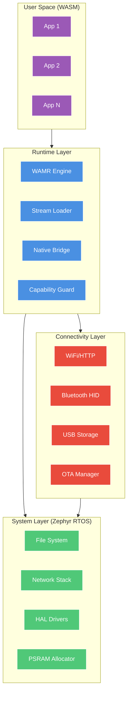

# AkiraOS

<div align="center">

**High-Performance WebAssembly OS for Embedded Systems**

[](VERSION)
[](https://github.com/zephyrproject-rtos/zephyr)
[](https://github.com/bytecodealliance/wasm-micro-runtime)
[](LICENSE)

*A production-ready embedded OS combining Zephyr RTOS with WebAssembly sandboxed execution.*

[Quick Start](#-quick-start) • [Architecture](#-architecture) • [Features](#-features) • [Documentation](#-documentation) • [Contributing](#-contributing)

</div>

---

## 🎯 Overview

AkiraOS is an embedded operating system designed for **secure, dynamic application execution** on resource-constrained devices. It leverages **WASM Micro Runtime (WAMR)** for sandboxed applications while maintaining real-time performance through **Zephyr RTOS**.

### Core Principles

1. **Zero-Trust Execution** – All user applications run in WebAssembly sandboxes with capability-based access control.
2. **Direct-to-Hardware Performance** – Zero-copy data paths and direct callback dispatch eliminate unnecessary abstractions.
3. **Modular Connectivity** – WiFi, Bluetooth, USB, and mesh networking with unified streaming API.
4. **OTA-First Design** – Atomic firmware updates with rollback protection via MCUboot.

---

## 🏗️ Architecture

AkiraOS uses a **layered modular architecture** with three primary subsystems:



### Key Components

| Layer | Purpose | Technology |
|-------|---------|------------|
| **User Space** | Sandboxed applications | WebAssembly (WASI) |
| **Runtime** | Execution engine & security | WAMR iWasm + AOT |
| **Connectivity** | Data transport & OTA | WiFi, BLE, USB, HTTP |
| **System** | Hardware abstraction | Zephyr RTOS 4.3.0 |

---

## ✨ Features

### Runtime Capabilities

- ✅ **WebAssembly Execution** – WAMR with AOT compilation support
- ✅ **Direct-Stream Loading** – Zero-copy WASM module loading from network/storage
- ✅ **Capability-Based Security** – Fine-grained permission system for native APIs
- ✅ **PSRAM Memory Management** – Efficient heap allocation for large applications
- ✅ **Native API Bridge** – Direct function calls (< 50ns latency)

### Connectivity Stack

- ✅ **WiFi HTTP Server** – Multipart file upload, JSON API, OTA endpoints
- ✅ **Bluetooth HID** – Keyboard/mouse/gamepad support
- ✅ **USB Mass Storage** – Drag-and-drop firmware updates
- ✅ **OTA Manager** – Atomic firmware updates with signature verification
- ✅ **Zero-Copy Data Paths** – Direct callback dispatch to consumers

### System Features

- ✅ **Dual-Boot Support** – MCUboot with fallback recovery
- ✅ **File System** – LittleFS on flash with wear leveling
- ✅ **Sensor Framework** – Unified API for environmental sensors
- ✅ **Power Management** – Deep sleep modes with wake-on-event
- ✅ **Shell Interface** – Debug console with command-line tools

---

## 🚀 Quick Start

### Prerequisites

- **Linux/WSL2** (Ubuntu 20.04+)
- **Python 3.8+**
- **West**: `pip install west`

### 1. Clone and Initialize

```bash
# Create workspace
mkdir akira-workspace && cd akira-workspace
git clone --recursive https://github.com/ArturR0k3r/AkiraOS.git
cd AkiraOS

# Initialize Zephyr workspace
west init -l .
cd .. && west update
```

### 2. Install Zephyr SDK

```bash
cd ~
wget https://github.com/zephyrproject-rtos/sdk-ng/releases/download/v0.17.0/zephyr-sdk-0.17.0_linux-x86_64.tar.xz
tar xvf zephyr-sdk-0.17.0_linux-x86_64.tar.xz
cd zephyr-sdk-0.17.0
./setup.sh
```

### 3. Build and Flash

```bash
cd akira-workspace/AkiraOS

# Build for ESP32-S3
./build.sh -b esp32s3_devkitm_esp32s3_procpu

# Flash to device
west flash

# Monitor output
west espmonitor
```

**For detailed setup instructions, see [QUICKSTART.md](QUICKSTART.md).**

---

## 📚 Documentation

| Document | Description |
|----------|-------------|
| [QUICKSTART.md](QUICKSTART.md) | Step-by-step setup guide |
| [Architecture.md](docs/Architecture.md) | System design and data flows |
| [Runtime README](src/runtime/README.md) | WAMR integration and execution model |
| [Connectivity README](src/connectivity/README.md) | Network stack and transport layer |
| [Hardware.md](docs/Hardware.md) | Supported boards and peripherals |
| [CONTRIBUTING.md](CONTRIBUTING.md) | Development guidelines |

---

## 🎮 Supported Hardware

| Platform | Status | Memory | Features |
|----------|--------|--------|----------|
| **ESP32-S3** | ✅ Primary | 512KB + 8MB PSRAM | WiFi, BLE, USB, Full OTA |
| **ESP32** | ✅ Supported | 520KB RAM | WiFi, BLE, Limited PSRAM |
| **ESP32-C3** | ✅ Supported | 400KB RAM | WiFi, BLE (RISC-V) |
| **Native Sim** | ✅ Development | Host memory | Fast testing without hardware |
| **nRF54L15** | 🚧 Experimental | 256KB RAM | Bluetooth LE, ARM Cortex-M33 |
| **STM32** | 🚧 In Progress | Varies | B-U585I-IOT02A, STEVAL-STWINBX1 |

**Recommended:** ESP32-S3 DevKitM for full feature support and optimal performance.

---

## 🔧 Build System

### Build Scripts

```bash
# Build all platforms
./build.sh -b esp32s3_devkitm_esp32s3_procpu        # ESP32-S3
./build.sh -b esp32_devkitc_procpu                  # ESP32
./build.sh -b esp32c3_devkitm                       # ESP32-C3
./build.sh -b native_sim                            # Native simulation

# Clean rebuild
./build.sh -b esp32s3_devkitm_esp32s3_procpu -r all

# Run native simulation
cd ../build && ./zephyr/zephyr.exe
```

### Configuration

Key configuration files:

- **[prj.conf](prj.conf)** – Global Kconfig settings
- **[boards/*.conf](boards/)** – Board-specific configurations
- **[boards/*.overlay](boards/)** – Device tree overlays
- **[west.yml](west.yml)** – Dependency manifest

---

## 🔒 Security Model

AkiraOS implements **defense-in-depth** security:

### 1. WebAssembly Sandboxing

- All user code runs in WASM sandbox
- No direct memory access to kernel space
- Stack/heap isolation per application

### 2. Capability-Based Access Control

```c
// Apps must request permissions via manifest
{
  "capabilities": ["log.write", "storage.read", "display.draw"]
}
```

### 3. Secure Boot Chain

1. **MCUboot** validates firmware signature
2. **WAMR** validates WASM module checksum
3. **Runtime** enforces capability checks on every native call

### 4. OTA Security

- HTTPS/TLS transport
- SHA-256 integrity verification
- Atomic updates with rollback on failure

---

## 🌐 Connectivity Protocols

### WiFi (HTTP Server)

- **Port:** 80 (configurable)
- **Endpoints:**
  - `POST /upload` – Multipart file upload
  - `POST /ota/upload` – Firmware update
  - `GET /status` – System status JSON

### Bluetooth

- **Profiles:** HID (keyboard, mouse, gamepad)
- **Services:** Custom GATT for app transfer
- **Security:** Pairing with PIN/passkey

### USB

- **Mass Storage Class** – Drag-and-drop file access
- **CDC ACM** – Serial console over USB

---

## 📊 Performance Metrics

Measured on **ESP32-S3 @ 240MHz** with 8MB PSRAM:

| Metric | Value | Notes |
|--------|-------|-------|
| **Boot Time** | ~2.5s | Cold boot to shell prompt |
| **WASM Load** | ~150ms | 100KB module from PSRAM |
| **Native Call Latency** | <50ns | Direct jump table dispatch |
| **HTTP Upload** | ~1.1MB/s | Multipart to file system |
| **OTA Flash Write** | ~200KB/s | Includes verification |
| **WASM Execution** | ~70% native | AOT-compiled benchmarks |

---

## 🛠️ Development Workflow

### 1. Local Development

```bash
# Native simulation (fastest iteration)
./build.sh -b native_sim
cd ../build && ./zephyr/zephyr.exe
```

### 2. Hardware Testing

```bash
# Build and flash to ESP32-S3
./build.sh -b esp32s3_devkitm_esp32s3_procpu
west flash
west espmonitor
```

### 3. WASM Application Development

```bash
cd wasm_sample
./build_wasm_apps.sh
# Generated .wasm files can be uploaded via HTTP
```

---

## 🤝 Contributing

We welcome contributions! Please see [CONTRIBUTING.md](CONTRIBUTING.md) for guidelines.

### Development Setup

1. Fork the repository
2. Create a feature branch: `git checkout -b feature/amazing-feature`
3. Test on native_sim first
4. Test on target hardware (ESP32-S3 recommended)
5. Submit a pull request

### Code Style

- **C Code:** Follow Zephyr coding style
- **Documentation:** Markdown with Mermaid diagrams
- **Commits:** Conventional commits format

---

## 📜 License

AkiraOS is licensed under the **Apache License 2.0**. See [LICENSE](LICENSE) for details.

### Third-Party Components

- **Zephyr RTOS** – Apache 2.0
- **WASM Micro Runtime** – Apache 2.0
- **MCUboot** – Apache 2.0
- **ESP-IDF Components** – Apache 2.0

---

## 🌟 Roadmap

### v1.5.0 (Planned)

- [ ] ARM Cortex-M support (nRF54L15, STM32)
- [ ] LVGL integration for GUI applications
- [ ] LoRa mesh networking
- [ ] Python bindings for native API

### v2.0.0 (Future)

- [ ] Multi-core WASM execution
- [ ] GPU acceleration (ESP32-P4)
- [ ] Real-time scheduling guarantees
- [ ] Cloud integration (MQTT, AWS IoT)

---

## 💬 Community

- **GitHub Issues:** [Report bugs](https://github.com/ArturR0k3r/AkiraOS/issues)
- **Discussions:** [Ask questions](https://github.com/ArturR0k3r/AkiraOS/discussions)
- **Wiki:** [Community documentation](https://github.com/ArturR0k3r/AkiraOS/wiki)

---

## 🙏 Acknowledgments

Built on the shoulders of giants:

- **Zephyr Project** – Robust RTOS foundation
- **Bytecode Alliance** – WAMR excellence
- **Espressif Systems** – ESP32 SDK and tools
- **Nordic Semiconductor** – nRF development tools

---

<div align="center">

**Made with ❤️ by the AkiraOS Team**

[⬆ Back to Top](#akiraos)

</div> 