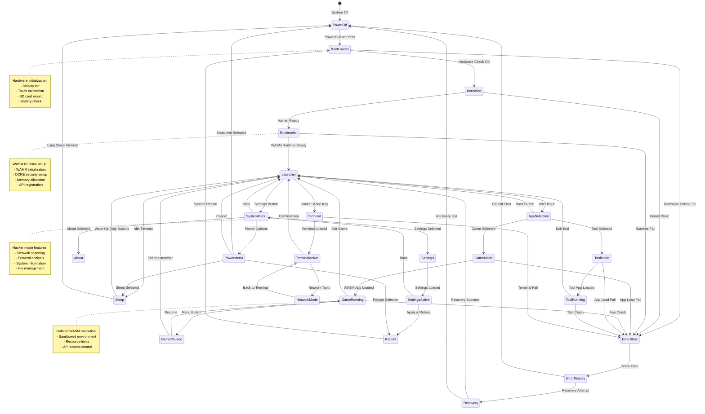

## **Architecture**

```c
┌─────────────────────────────┐
│      AkiraOS WASM Apps      │ ← Games, Tools, Utilities, User Apps
├─────────────────────────────┤
│      OCRE Runtime           │ ← Open Container Runtime (OCI/WASM), Security, Sandboxing
├─────────────────────────────┤
│    WASM-Micro-RT            │ ← WASM Execution Environment for OCRE
├─────────────────────────────┤
│      Akira Shell            │ ← Command-line, Debug Console, Scripting
├─────────────────────────────┤
│      OTA Manager            │ ← Firmware Updates, MCUboot Integration
├─────────────────────────────┤
│      Settings Module        │ ← Persistent User/Device Settings
├─────────────────────────────┤
│      Networking Stack       │ ← WiFi, TCP/IP, HTTP, Web Server
├─────────────────────────────┤
│         Akira               │
│      graphic engine         │ ← Hardware drivers and libs, Framebuffer, UI Rendering ... 
│      and Hardware drivers   │
├─────────────────────────────┤
│      Zephyr OS              │ ← RTOS, Device Drivers, Kernel Services
├─────────────────────────────┤
│      ESP32 HAL              │ ← Hardware Abstraction, GPIO, SPI, UART, I2C
└─────────────────────────────┘
```

## AkiraOS State Diagram



## Hardware Configuration

### ESP32 DevKit C to ILI9341 Display Pin Mapping

#### SPI Display Connections
| ESP32 GPIO | ILI9341 Pin | Function | Notes |
|------------|-------------|----------|--------|
| GPIO23     | MOSI (SDI)  | SPI Data Out | Data from ESP32 to display |
| GPIO25     | MISO (SDO)  | SPI Data In  | Optional - for reading display |
| **GPIO19** | SCK         | SPI Clock    | **Main clock line** |
| GPIO22     | CS          | Chip Select  | Manual control |
| GPIO21     | DC          | Data/Command | Low=Command, High=Data |
| GPIO18     | RESET       | Reset        | Hardware reset |
| GPIO27     | LED         | Backlight    | PWM capable for dimming |

#### Gaming Control Buttons
| ESP32 GPIO | Button | Type | Notes |
|------------|--------|------|--------|
| GPIO12     | Power/Menu | Input | Pull-up enabled |
| GPIO16     | Settings | Input | Pull-up enabled |
| GPIO34     | D-Pad Up | Input Only | ⚠️ No pull-up (external required) |
| GPIO33     | D-Pad Down | Input | Pull-up enabled |
| GPIO32     | D-Pad Left | Input | Pull-up enabled |
| GPIO39     | D-Pad Right | Input Only | ⚠️ No pull-up (external required) |
| GPIO17     | A Button | Input | Pull-up enabled |
| GPIO14     | B Button | Input | Pull-up enabled |
| GPIO35     | X Button | Input Only | ⚠️ No pull-up (external required) |
| GPIO13     | Y Button | Input | Pull-up enabled |


| ESP32S3 GPIO | Button | Type | Notes |
|------------|--------|------|--------|
| GPIO7      | Power/Menu | Input | Pull-up enabled |
| GPIO42     | Settings | Input | Pull-up enabled |
| GPIO3      | D-Pad Up | Input Only | ⚠️ No pull-up (external required) |
| GPIO41     | D-Pad Down | Input | Pull-up enabled |
| GPIO47     | D-Pad Left | Input | Pull-up enabled |
| GPIO40     | D-Pad Right | Input Only | ⚠️ No pull-up (external required) |
| GPIO46     | A Button | Input | Pull-up enabled |
| GPIO14     | B Button | Input | Pull-up enabled |
| GPIO15     | X Button | Input Only | ⚠️ No pull-up (external required) |
| GPIO39     | Y Button | Input | Pull-up enabled |

