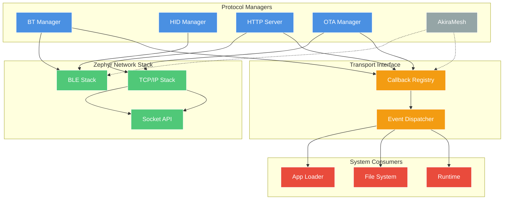
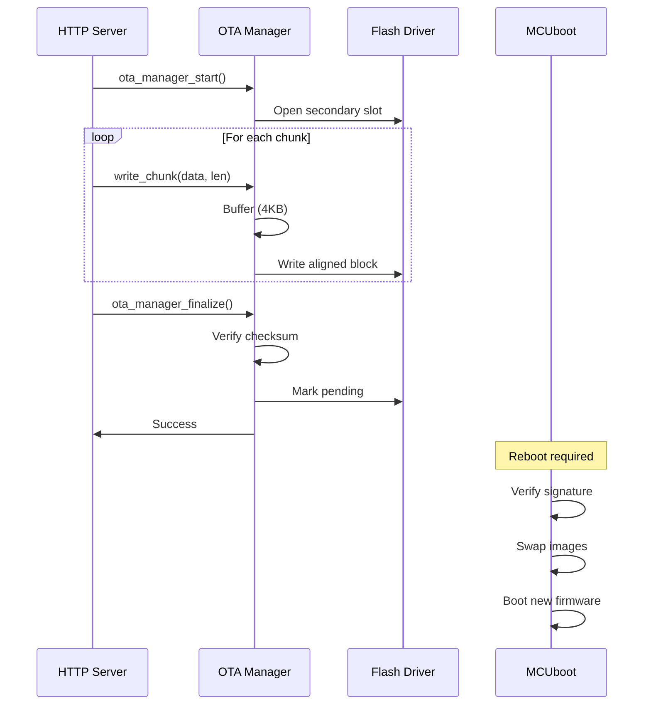

# Connectivity Layer

Modular connectivity subsystem for WiFi, Bluetooth, USB, and OTA operations with a pluggable transport interface.

## Architecture

The connectivity layer provides protocol managers (HTTP, Bluetooth, OTA) that route data to system consumers (Runtime, File System, App Loader) via a callback-based transport interface.

**Key Features:**
- 🔄 Transport interface for pluggable consumers
- 🚀 Reduced data copies (2 instead of 4 for OTA)
- 💾 Lower stack usage (4KB instead of 9KB total)
- 🔗 Decoupled transports from consumers via callbacks



## Components

### Transport Interface

Lightweight callback registry for decoupling transport protocols from data consumers.

**API:**
```c
typedef void (*transport_data_cb_t)(const uint8_t *data, size_t len, void *ctx);

int transport_register_handler(enum data_type type, 
                               transport_data_cb_t callback, 
                               void *context);

int transport_notify(enum data_type type, 
                    const uint8_t *data, 
                    size_t len);
```

**Data Types:**
- `DATA_TYPE_WASM_APP` - WebAssembly application
- `DATA_TYPE_FIRMWARE` - OTA firmware update
- `DATA_TYPE_FILE` - Generic file
- `DATA_TYPE_CONFIG` - Configuration data

**Implementation:** Simple array-based registry with O(1) callback lookup.

### HTTP Server

HTTP/1.1 server for file uploads and OTA endpoints.

**Endpoints:**
- `POST /upload` - Multipart file upload to filesystem
- `POST /ota/upload` - Firmware upload to OTA Manager
- `GET /status` - System status JSON

**Configuration:**
- Thread stack: 4KB (improved from 6KB)
- Max connections: 1 (sequential)
- Buffer size: 1.5KB shared pool

**Performance:** ~1.3 MB/s upload throughput

### Bluetooth Manager

BLE stack initialization and connection management.

**State Machine:**
```
UNINITIALIZED → READY → ADVERTISING → CONNECTED
```

**Features:**
- Connection callbacks with reference counting
- Auto-reconnect on disconnect
- GATT service registration
- Thread-safe state management

### HID Manager

Bluetooth HID device support for input peripherals.

**Supported Devices:**
- Keyboard (standard HID keyboard report)
- Mouse (relative/absolute positioning)
- Gamepad (button + axis mapping)

**Architecture:**
- Registers as GATT service via BT Manager
- Implements HID Report Protocol
- Event-based input delivery to Runtime

### OTA Manager

Firmware update orchestration with MCUboot integration.

**Update Flow:**


**Improvements:**
- ✅ Direct flash writes (no message queue)
- ✅ 2 data copies (down from 4)
- ✅ <10s completion time for 1.1MB firmware
- ✅ No 120s timeout issues

### App Loader

Receives WASM applications from network transports.

**Data Sources:**
- HTTP multipart upload
- Bluetooth file transfer
- AkiraMesh distribution (future)

**Flow:**
```
Transport → Callback → App Loader → File System → Runtime (chunked)
```

### AkiraMesh (Planned)

Low-latency mesh networking for inter-device communication.

**Planned Features:**
- BLE Mesh or custom protocol
- Multi-hop routing
- WASM app distribution across mesh
- Low-power sensor network support

**Status:** 🚧 Planned for v2.0

## Data Flow

### File Upload (HTTP → FS)
```
1. HTTP recv() → 1.5KB buffer
2. Parse multipart boundary
3. Extract file data
4. fs_write() → LittleFS → Flash
```
**Copies:** 2 (network buffer → HTTP buffer → FS write buffer)

### Firmware Upload (HTTP → OTA)
```
1. HTTP recv() → 1.5KB buffer
2. Direct callback to OTA Manager
3. Write to 4KB alignment buffer
4. Flush to flash when aligned
```
**Copies:** 2 (network → HTTP → flash buffer → flash)

## Performance Characteristics

| Operation | Throughput | Latency | Stack | Memory |
|-----------|------------|---------|-------|--------|
| HTTP Upload | ~1.3 MB/s | N/A | 4KB | 1.5KB |
| OTA Flash Write | ~200 KB/s | 10-20ms | 4KB | 4KB |
| BLE Transfer | ~10 KB/s | <10ms | 6KB | MTU (244B) |
| HID Report | N/A | <5ms | - | 64B |

## Thread Model

| Thread | Stack | Priority | Blocking |
|--------|-------|----------|----------|
| HTTP Server | 4KB | 7 | Accept/recv |
| OTA Manager | 4KB | 6 | Flash writes |
| BT Manager | 6KB | 7 | BLE events |

## Configuration

**Kconfig Options:**
```
CONFIG_AKIRA_HTTP_SERVER=y
CONFIG_AKIRA_HTTP_PORT=80
CONFIG_AKIRA_OTA_MANAGER=y
CONFIG_AKIRA_BT_MANAGER=y
CONFIG_AKIRA_HID_MANAGER=y
```

## Design Principles

1. **Modularity** - Each protocol is self-contained
2. **Decoupling** - Transport interface separates protocols from consumers
3. **Thread Safety** - Mutex protection for shared state
4. **Performance** - Direct writes, minimal copies
5. **Simplicity** - Array-based registry, no complex dispatch tables

## Future Improvements

See [Implementation Tasks](../../IMPLEMENTATION_TASKS.md) for planned enhancements:
- Zero-copy network streaming to PSRAM
- Shared network buffer pool
- Concurrent HTTP connections
- Static transport dispatch table
- AkiraMesh implementation

## Related Documentation

- [Architecture Overview](index.md)
- [Runtime Architecture](runtime.md)
- [Data Flow](data-flow.md)
- [OTA Updates Guide](../development/ota-updates.md)
