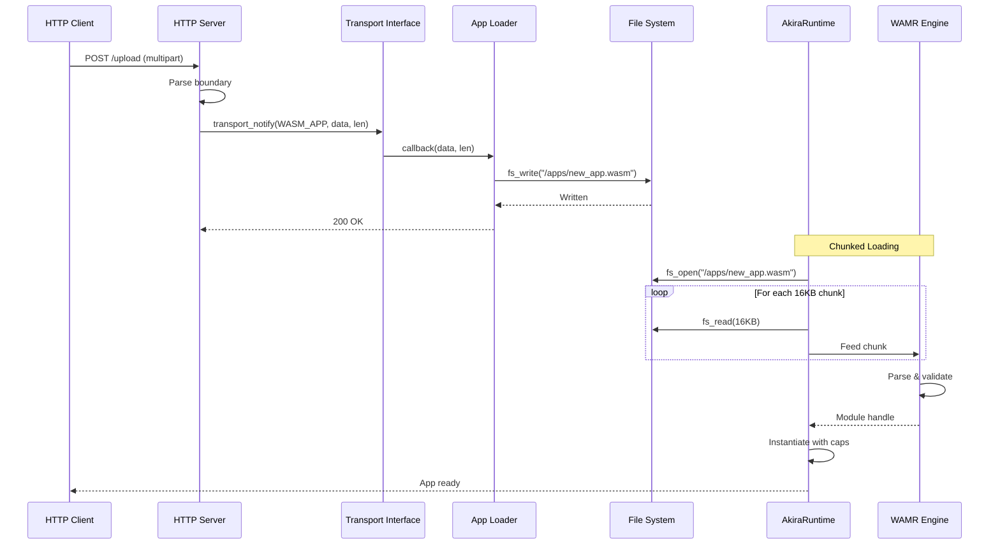
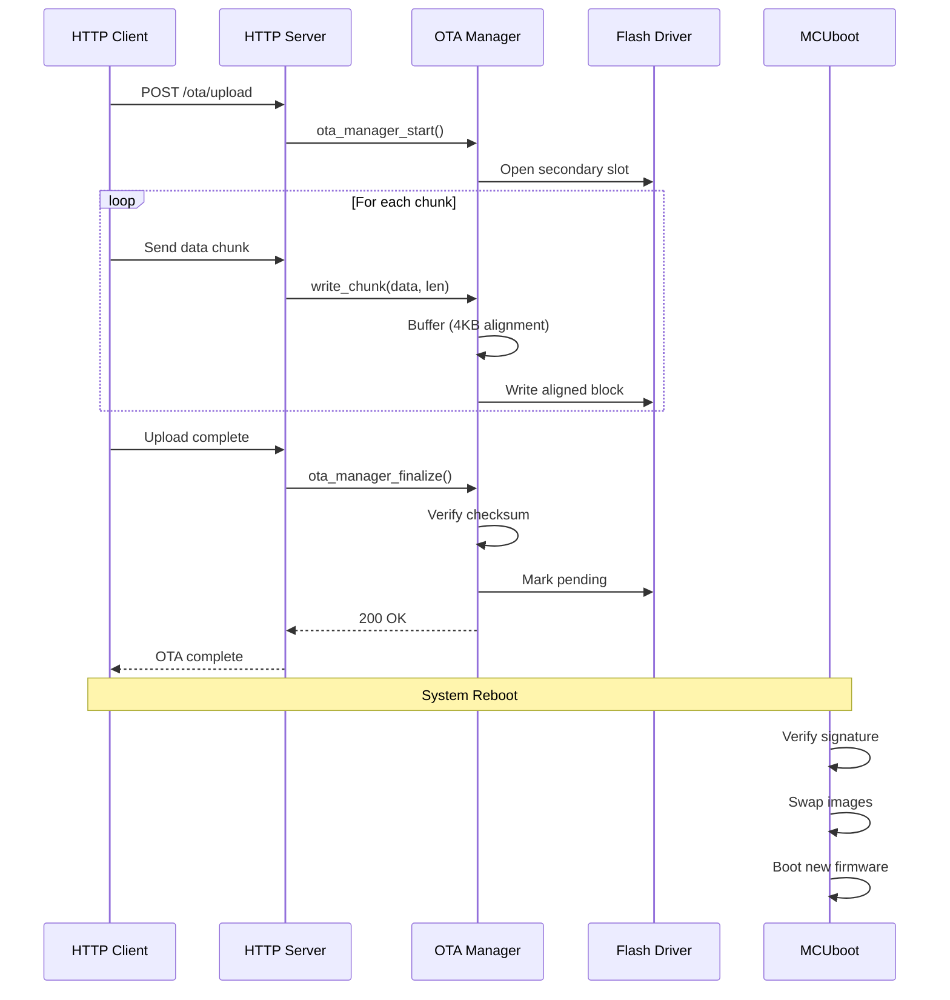
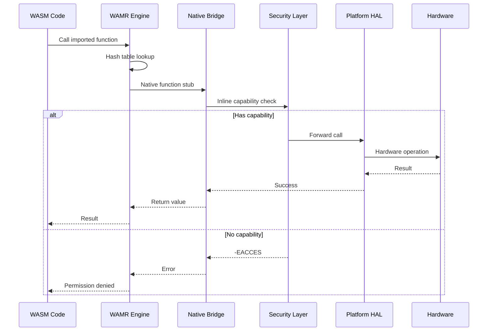
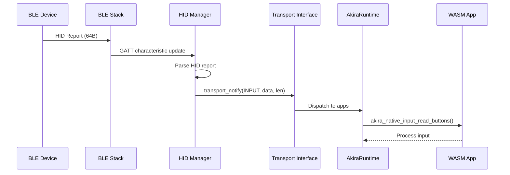
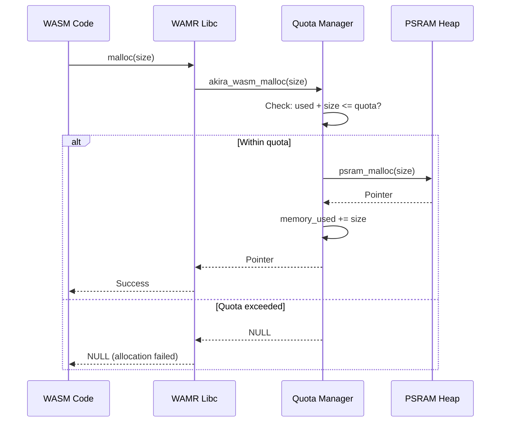
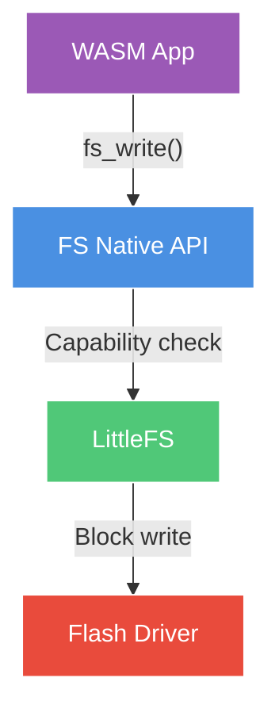

# Data Flow Architecture

End-to-end data flow diagrams showing how information moves through AkiraOS subsystems.

## Overview

Data flows through AkiraOS via three primary paths:
1. **Application Loading** - Network → Storage → Runtime
2. **Firmware Updates** - Network → Flash → MCUboot
3. **Runtime Execution** - WASM → Native APIs → Hardware

## Application Loading Flow

### Network Upload → File System → Runtime



**Data Copies:** 2 (network buffer → HTTP buffer → FS write buffer)

**Memory Usage:**
- HTTP buffer: 1.5KB
- FS write buffer: 4KB (internal)
- Runtime chunk: 16KB (temporary)
- Peak: ~22KB

---

## Firmware Update Flow (OTA)

### Network → Flash → MCUboot



**Improvements:**
- ✅ Direct flash writes (no message queue)
- ✅ 2 data copies (down from 4)
- ✅ <10s for 1.1MB firmware
- ✅ No 120s timeout issues

**Data Copies:** 2 (network buffer → HTTP buffer → flash buffer → flash)

**Memory Usage:**
- HTTP buffer: 1.5KB
- OTA alignment buffer: 4KB
- Peak: ~6KB

---

## Runtime Execution Flow

### WASM Application → Native APIs → Hardware



**Performance:**
- Hash lookup: ~20ns
- Capability check: ~10ns (inline)
- HAL call: ~30ns
- **Total overhead:** ~60ns

---

## Bluetooth Data Flow

### BLE → HID Manager → Runtime → WASM



**Latency:** <5ms from BLE event to WASM callback

---

## Sensor Data Flow

### Sensor → Driver → WASM


**Call Stack:**
```
wasm_app_code()
  └─ akira_native_sensor_read()         [~60ns overhead]
      └─ platform_sensor_read()          [HAL layer]
          └─ i2c_burst_read()             [Zephyr driver]
              └─ Hardware I2C transaction [~500μs]
```

---

## Memory Allocation Flow

### WASM malloc → Quota Check → PSRAM



**Quota Limits:**
- Default: 64KB per app
- Maximum: 128KB per app
- Total pool: 256KB PSRAM

---

## File System Operations

### WASM → FS API → LittleFS → Flash



**Write Path:**
1. `wasm_app_write()` - WASM calls native FS API
2. Capability check - `CAP_FS_WRITE` verified
3. Path validation - Restrict to `/data/<app_name>/`
4. LittleFS write - Wear leveling, journaling
5. Flash write - Sector erase + program

**Read Path:** Similar but checks `CAP_FS_READ`

---

## Data Flow Summary

| Flow | Source | Destination | Copies | Peak Memory | Latency |
|------|--------|-------------|--------|-------------|---------|
| **App Upload** | HTTP | File System | 2 | ~22KB | ~200ms (100KB) |
| **OTA Update** | HTTP | Flash | 2 | ~6KB | ~10s (1.1MB) |
| **Native Call** | WASM | Hardware | 0 | N/A | ~60ns |
| **BLE Input** | HID | WASM | 1 | 64B | <5ms |
| **Sensor Read** | I2C | WASM | 1 | ~16B | ~500μs |
| **File Write** | WASM | Flash | 2 | ~4KB | ~10ms |

---

## Optimization Opportunities

### Current Bottlenecks
1. **HTTP → FS:** 2 copies (network → HTTP → FS)
2. **WASM Loading:** File-based (need network streaming)
3. **Native Calls:** WAMR hash lookup (~20ns)

### Planned Improvements
- **Zero-copy networking:** Stream directly to PSRAM
- **Static jump table:** Remove hash lookup (<50ns calls)
- **Network streaming:** Load WASM directly from HTTP

See [Implementation Tasks](../../IMPLEMENTATION_TASKS.md) for details.

---

## Related Documentation

- [Architecture Overview](index.md)
- [Connectivity Layer](connectivity.md)
- [Runtime Architecture](runtime.md)
- [Performance Benchmarks](../resources/performance.md)
