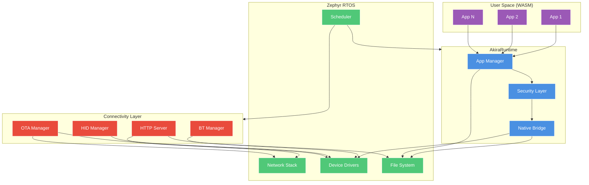

# Architecture Overview

AkiraOS employs a **layered modular architecture** designed for secure, high-performance WebAssembly execution on embedded systems.

## System Architecture



## Architecture Layers

### [User Space](../api-reference/)
WebAssembly applications run in isolated sandboxes with capability-based access control.

- **Execution:** WASM bytecode via WAMR
- **Security:** Per-app capabilities, memory quotas
- **Size:** 50KB-200KB per app
- **Max Instances:** 4 concurrent apps

[Learn more about the Runtime →](runtime.md)

### [AkiraRuntime](runtime.md)
Custom WASM runtime managing application lifecycle, security, and native API bridging.

- **App Management:** Load, start, stop, unload
- **Security:** Inline capability checks (~60ns overhead)
- **Memory:** PSRAM allocation with per-app quotas
- **Native APIs:** Display, input, sensors, RF, logging

[Runtime Architecture Details →](runtime.md)

### [Connectivity Layer](connectivity.md)
Modular protocol stack for WiFi, Bluetooth, USB, and OTA operations.

- **Transport Interface:** Callback-based data routing
- **HTTP Server:** File uploads, OTA endpoints
- **Bluetooth:** BLE stack, HID support
- **OTA Manager:** MCUboot firmware updates
- **AkiraMesh:** Planned mesh networking

[Connectivity Architecture Details →](connectivity.md)

### [Zephyr RTOS](https://docs.zephyrproject.org)
Real-time kernel providing threading, networking, drivers, and file system.

- **Scheduler:** Preemptive multitasking
- **Network Stack:** TCP/IP, BLE
- **Drivers:** SPI, I2C, UART, GPIO, flash
- **File System:** LittleFS on flash storage

[Platform Support →](../platform/)

## Key Components

| Component | Purpose | Location |
|-----------|---------|----------|
| App Manager | WASM app lifecycle | [Runtime](runtime.md) |
| Security Layer | Capability enforcement | [Security](security.md) |
| Native Bridge | WASM↔Native calls | [Runtime](runtime.md) |
| Transport Interface | Protocol routing | [Connectivity](connectivity.md) |
| OTA Manager | Firmware updates | [Connectivity](connectivity.md) |
| HTTP Server | Network API | [Connectivity](connectivity.md) |

## Data Flow

### Application Loading
```
Network → Transport Interface → App Loader → File System → Chunked Loader → WAMR → App Instance
```

### Firmware Update (OTA)
```
HTTP POST → OTA Manager → Flash Driver → MCUboot Secondary Slot → Reboot → Verify → Activate
```

### Native API Call
```
WASM Code → WAMR Import → Native Bridge → Inline Cap Check → HAL Function → Hardware
```

[Detailed Data Flow Diagrams →](data-flow.md)

## Design Principles

1. **Zero-Trust Execution** – All apps sandboxed with explicit capabilities
2. **Direct-to-Hardware** – Minimal abstraction layers for performance
3. **Modular Connectivity** – Pluggable transport protocols
4. **OTA-First** – Atomic updates with rollback protection
5. **Resource Constrained** – Optimized for devices with <1MB RAM

## Performance Targets

| Metric | Current | Target |
|--------|---------|--------|
| Native Call Overhead | ~60ns | <50ns |
| WASM Load Time (100KB) | ~80ms | <50ms |
| OTA Flash Write | ~200 KB/s | ~300 KB/s |
| HTTP Throughput | ~1.3 MB/s | ~2 MB/s |
| Memory Overhead | ~32KB | <24KB |

[Performance Benchmarks →](../resources/performance.md)

## Security Model

- **Sandboxing:** WASM memory isolation
- **Capabilities:** Fine-grained permission bits
- **Quotas:** Per-app memory limits
- **Manifest:** Embedded capability declarations
- **Flash Protection:** Read-only app storage

[Security Architecture →](security.md)

## Documentation Structure

- [System Overview](system-overview.md) - Complete architecture guide
- [Connectivity Layer](connectivity.md) - Network protocols
- [AkiraRuntime](runtime.md) - WASM execution environment
- [Security Model](security.md) - Capability system
- [Data Flow](data-flow.md) - Information flow diagrams

## Related Documentation

- [Getting Started](../getting-started/) - Setup guides
- [API Reference](../api-reference/) - Developer APIs
- [Platform Guides](../platform/) - Board-specific docs
- [Development](../development/) - Build & debug
