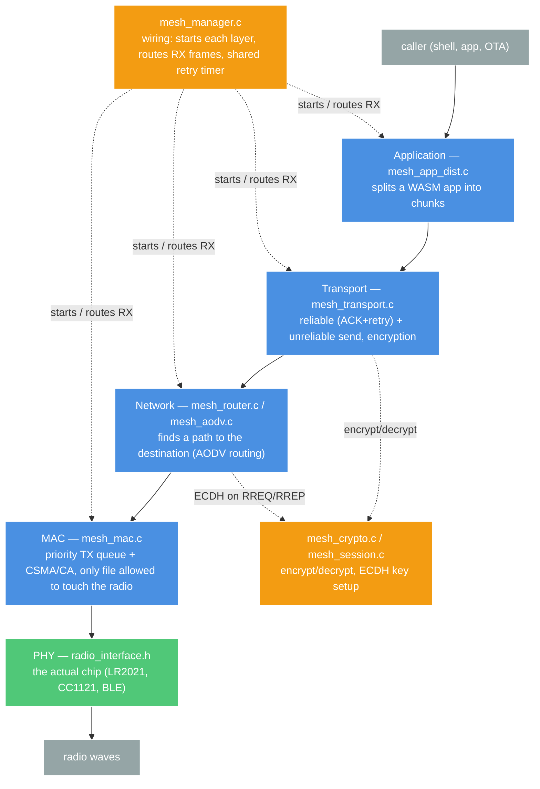
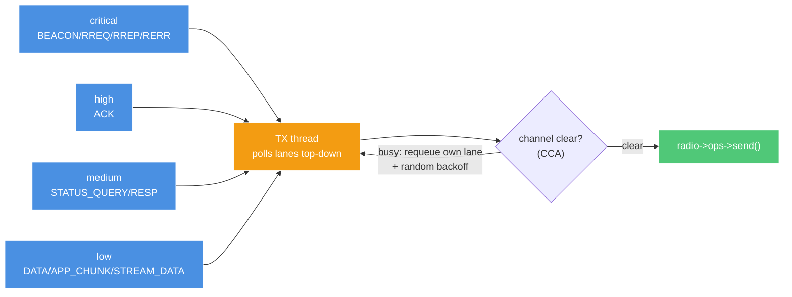

# AkiraMesh

Custom mesh network stack. Multi-hop, works over LoRa/sub-GHz/BLE radios.
Code: `src/connectivity/mesh/`. Public API: `include/connectivity/akira_mesh.h`.

## Layers

Each layer only talks to the one below it.

Each layer only talks to the one below it. `mesh_crypto.c`/`mesh_session.c`
and `mesh_manager.c` aren't layers — they're helpers the layers above call
directly, not links in the send path.

## Sending a Packet

1. You call `akira_mesh_send(dest, data, len)`.
2. Transport asks Network: "do I have a path to `dest`?"
   - **Yes (warm)** → encrypt, hand to MAC, done.
   - **No (cold)** → Network broadcasts a "who has this ID?" request
     (RREQ) and Transport holds the message.
3. Every node that hears the RREQ remembers "packets for the sender go back
   this way," then re-broadcasts it one hop further (unless it's the
   target).
4. The target replies (RREP), tracing the same path back. Every node
   along the way now also knows "packets for the target go this way."
5. When the reply reaches the original sender, the held message gets
   encrypted and sent immediately — no need to call `akira_mesh_send`
   again.
6. MAC puts the frame on the radio. Every neighbor hears it; only the one
   with a matching route re-sends it further. This repeats hop by hop
   until it reaches the target.

A route is forgotten after `CONFIG_AKIRA_MESH_ROUTE_LIFETIME_S` unused. A
broken link mid-route triggers a local retry (find a new path from where it
broke) before giving up.

## Encryption (E2EE)

- Every 1-to-1 message is encrypted, no exceptions. Broadcasts are not
  (no single recipient to encrypt to).
- Keys are set up for free during route discovery: the RREQ carries the
  sender's public key, the RREP carries the target's — both sides run ECDH
  and get the same shared key without a separate handshake.
- Each message: fresh random nonce, AES-256-CTR encryption, HMAC-SHA256 tag.
  Receiver checks the tag before trusting anything; bad tag = silently
  dropped.
- A session key lasts `CONFIG_AKIRA_MESH_SESSION_LIFETIME_S` idle, refreshed
  automatically while a transfer is active so it never expires mid-transfer.

## MAC / Channel Access (`mesh_mac.c`)

Sole owner of the radio's send/recv calls. Everything above enqueues a
frame instead of touching the radio directly.

- **4 priority lanes**, one `K_MSGQ` each — a frame is routed to a lane by
  its `msg_type` (`mesh_mac_send()` for direct sends,
  `mesh_mac_prio_for_msg_type()` for relayed/retransmitted frames).
- **Strict priority**: the TX thread checks critical first, then high,
  medium, low — every iteration. A lower lane starves only under sustained
  higher-lane traffic.
- **CCA is a single non-blocking RSSI check**, not a blocking wait: busy →
  the frame goes back to the tail of its own lane with a random backoff
  timestamp, and the thread immediately re-polls from the top. This is why
  a critical frame arriving mid-backoff doesn't wait behind a low-lane
  frame's CCA retry. Capped at `CONFIG_AKIRA_MESH_CCA_MAX_RETRIES` — after
  that it sends regardless, since CCA reduces collisions but the ACK/retry
  layer above is the actual reliability backstop. Only meaningful on radios
  advertising `RADIO_CAP_CCA` (CC1121/LR2021); skipped for BLE.

## Packet Format

Every frame has the same 21-byte header, then a type-specific body:

| Field | Meaning |
|---|---|
| `msg_type` | what kind of frame (data, route request, ack, ...) |
| `ttl` | hop budget, drops to 0 = frame dies |
| `src_id` / `dest_id` | original sender / final destination — **never change**, even across hops |
| `seq_num` | sender's counter, used to detect duplicates |

Note: `src_id`/`dest_id` are who started/wants the message, not who just
sent you the radio packet. Route-finding frames (RREQ/RREP) separately track
"immediate previous hop" for that.

## Reliability

- **Normal send** (`akira_mesh_send`): waits for an ACK, retries a few
  times, then gives up. Queues and triggers route discovery on a cold
  route.
- **Unreliable send** (`akira_mesh_send_unreliable`): fire-and-forget, no
  ACK, no retry. Needs an already-known route and session key — fails fast
  (`-EHOSTUNREACH` / `-ENOTCONN`) instead of queuing on a cold route. Still
  E2E encrypted like normal send.
- **Stream mode** (`akira_mesh_send_stream`): for bigger payloads. Sends a
  batch of frames, checks once which ones landed, resends only the gaps.
  Needs an already-known route (send a normal message first).
- **App distribution**: same idea as stream mode, one chunk per ACK,
  resumable if interrupted.

## File Map

| File | Job |
|---|---|
| `mesh_manager.c` | wiring, public API, RX routing |
| `mesh_mac.c` | radio access, priority TX queue, CSMA/CA |
| `mesh_router.c` / `mesh_aodv.c` | route finding |
| `mesh_transport.c` | reliable + unreliable send, encryption, stream mode |
| `mesh_app_dist.c` | WASM app transfer |
| `mesh_crypto.c` / `mesh_session.c` | encryption primitives, key storage |
| `mesh_routing.c` | shared tables (routes, pending sends, dedup) |
