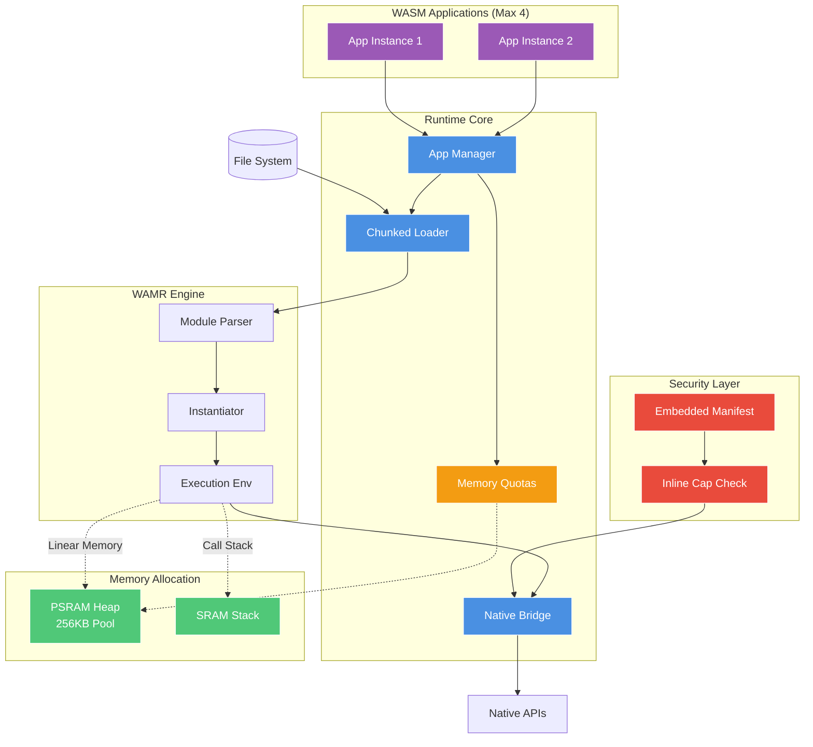
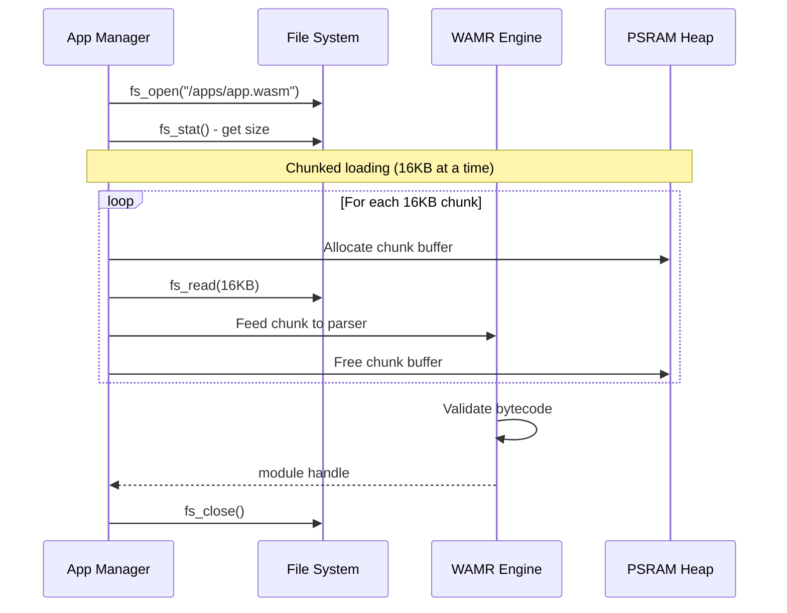
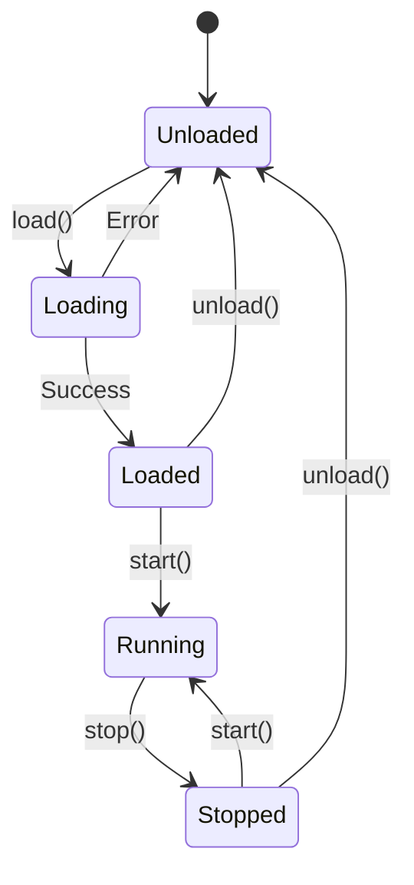

# AkiraRuntime Architecture

**Custom WebAssembly runtime for embedded systems.**

AkiraRuntime is a purpose-built WASM execution environment designed for resource-constrained devices. While it leverages WAMR (WebAssembly Micro Runtime) as the bytecode interpreter and AOT compiler, the runtime architecture—including application management, security model, native API bridge, and memory allocation—is custom-designed for AkiraOS.

## Overview

**Design Goal:** Build a high-performance streaming runtime that rivals native execution while maintaining security isolation.

**Key Features:**
- 🔄 Chunked file loading (50% less peak memory)
- ⚡ Inline capability checks (~60ns overhead)
- 💾 Per-app memory quotas (prevents exhaustion)
- 🔒 Embedded manifest support
- 🎯 Custom native APIs (not WASI)



## Components

### App Manager

Custom lifecycle orchestrator for WASM applications.

**This is NOT WAMR's app manager**—it's AkiraOS's own implementation that wraps WAMR modules with custom metadata, security policies, and resource management.

**Data Structure:**
```c
typedef struct {
    bool used;
    char name[32];
    wasm_module_t module;         // WAMR module handle
    wasm_module_inst_t instance;  // Instantiated module
    wasm_exec_env_t exec_env;     // Execution environment
    bool running;
    uint32_t cap_mask;            // Capability bitmask
    size_t memory_quota;          // Per-app memory limit
    size_t memory_used;           // Current usage tracking
} akira_managed_app_t;
```

**Operations:**
- `akira_runtime_load()` - Load WASM from file (chunked)
- `akira_runtime_start()` - Execute main function
- `akira_runtime_stop()` - Terminate execution
- `akira_runtime_unload()` - Free resources
- `akira_runtime_set_quota()` - Set memory limit

**Limits:** 4 concurrent app instances (adequate for embedded use cases)

### Chunked File Loader

Load WASM binaries from LittleFS with reduced memory footprint.

**Loading Flow:**


**Benefits:**
- ✅ 50% less peak memory (16KB vs entire file)
- ✅ Supports WASM files larger than available RAM
- ✅ Predictable memory usage
- ⏭️ Future: Network streaming directly to WAMR

### Native Bridge

Custom native API layer for AkiraOS system access.

**Not WASI:** AkiraRuntime uses custom native functions optimized for embedded peripherals, not POSIX-like WASI interfaces.

**Registered Functions:**
- `akira_native_display_clear()`
- `akira_native_display_pixel()`
- `akira_native_input_read_buttons()`
- `akira_native_rf_send()`
- `akira_native_sensor_read()`
- `akira_native_log()`

**Call Mechanism:**
```
WASM Code
  ↓
extern import call
  ↓
WAMR native lookup (hash table)
  ↓
Native function stub (inline cap check)
  ↓
if (!(cap_mask & CAP_BIT)) return -EACCES;  ← FAST PATH
  ↓
Actual API implementation
```

**Performance:**
- ✅ ~60ns native call overhead (down from ~100ns)
- ✅ Inline capability checks (no function call)
- ✅ Branch prediction friendly
- ⏭️ Future: Static jump table for <50ns

### Security Layer

Custom capability-based access control system.

**Capability Bits:**
```c
#define CAP_DISPLAY_WRITE   (1U << 0)
#define CAP_INPUT_READ      (1U << 1)
#define CAP_SENSOR_READ     (1U << 2)
#define CAP_RF_TRANSCEIVE   (1U << 3)
#define CAP_FS_READ         (1U << 4)
#define CAP_FS_WRITE        (1U << 5)
```

**Inline Enforcement:**
```c
// Macro for fast checking
#define AKIRA_CHECK_CAP_INLINE(inst, cap) \
    do { \
        uint32_t mask = get_app_cap_mask(inst); \
        if (!(mask & cap)) return -EACCES; \
    } while(0)

// Usage in native functions
int akira_native_display_clear(wasm_exec_env_t env, uint32_t color) {
    AKIRA_CHECK_CAP_INLINE(get_module_inst(env), CAP_DISPLAY_WRITE);
    return platform_display_clear(color);
}
```

**Embedded Manifest:**
```wasm
;; Custom section embedded in .wasm file
(custom "akira-manifest"
  (name "my_app")
  (version "1.0.0")
  (capabilities "display" "input" "sensor")
  (memory_quota 65536)  ;; 64KB limit
)
```

**Benefits:**
- ✅ ~40% faster permission checks
- ✅ Manifest embedded in WASM (no separate .json)
- ✅ Per-app memory quotas
- ⚠️ Still coarse-grained (no per-resource limits)

### Memory Management

**PSRAM Allocation:**
```c
CONFIG_HEAP_MEM_POOL_SIZE=262144  // 256KB PSRAM pool

// Per-app quotas
#define DEFAULT_APP_QUOTA   (64 * 1024)   // 64KB default
#define MAX_APP_QUOTA      (128 * 1024)   // 128KB maximum
```

**Quota Enforcement:**
```c
void *akira_wasm_malloc(size_t size) {
    akira_managed_app_t *app = get_current_app();
    if (app->memory_used + size > app->memory_quota) {
        return NULL;  // Quota exceeded
    }
    void *ptr = psram_malloc(size);
    if (ptr) {
        app->memory_used += size;
    }
    return ptr;
}
```

**Memory Layout:**
- WASM module code (after loading)
- WASM linear memory (app heap/stack)
- Native API buffers
- Temporary allocation during load

## WAMR Integration

AkiraRuntime wraps WAMR and provides:

| Component | WAMR Provides | AkiraRuntime Adds |
|-----------|---------------|-------------------|
| Module Loading | Bytecode parsing | Chunked file reading |
| Execution | Interpreter/AOT | Capability enforcement |
| Native Calls | Symbol lookup | Inline permission checks |
| Memory | Linear memory | Per-app quotas |
| Security | Sandboxing | Capability system |

**WAMR Configuration:**
```c
#define WASM_ENABLE_INTERP 1
#define WASM_ENABLE_AOT 0                   // Disabled (flash size)
#define WASM_ENABLE_FAST_INTERP 1
#define WASM_ENABLE_LIBC_BUILTIN 1
#define WASM_ENABLE_LIBC_WASI 0             // Custom APIs instead
```

## Performance

| Metric | Value | Target |
|--------|-------|--------|
| Native Call Overhead | ~60ns | <50ns |
| WASM Load Time (100KB) | ~80ms | <50ms |
| Memory Usage (per app) | 64-128KB | Configurable |
| Peak Load Memory | 16KB | Streaming |
| App Switch Latency | <1ms | <500μs |

## Application Lifecycle



**States:**
- **Unloaded:** No resources allocated
- **Loading:** Reading WASM, parsing, validating
- **Loaded:** Module instantiated, ready to run
- **Running:** Executing WASM code
- **Stopped:** Execution paused, resources retained

## Design Principles

1. **Custom Runtime** - Not just a WAMR wrapper; custom lifecycle and security
2. **Streaming First** - Chunked loading, future network streaming
3. **Performance** - Inline checks, minimal overhead
4. **Safety** - Capabilities, quotas, sandboxing
5. **Simplicity** - Fixed app count, straightforward API

## Future Improvements

See [Implementation Tasks](../../IMPLEMENTATION_TASKS.md) for planned enhancements:
- Static native function jump table (<50ns calls)
- Network streaming to WAMR (skip filesystem)
- Multi-core WASM execution
- JIT compilation support
- Advanced capability granularity

## Related Documentation

- [Architecture Overview](index.md)
- [Security Model](security.md)
- [Native API Reference](../api-reference/native-api.md)
- [Building WASM Apps](../development/building-apps.md)
