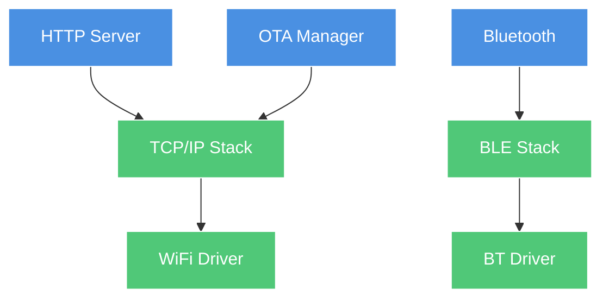

# System Overview

AkiraOS is a high-performance embedded operating system combining **Zephyr RTOS** with **WebAssembly sandboxed execution** for secure, dynamic application deployment on resource-constrained devices.

## System Components

### Hardware Layer
- **Target:** ESP32-S3 (primary), nRF54L15, STM32 (supported)
- **RAM:** 512KB SRAM + 2-8MB PSRAM
- **Flash:** 8-16MB for firmware + apps
- **Peripherals:** SPI, I2C, UART, GPIO, WiFi, Bluetooth

### Kernel Layer (Zephyr RTOS)
- **Scheduler:** Preemptive multitasking with priority queues
- **Network Stack:** TCP/IP, UDP, BLE
- **Drivers:** HAL abstractions for all peripherals
- **File System:** LittleFS on flash partition
- **Boot:** MCUboot for secure boot and OTA updates

### Connectivity Layer
- **HTTP Server:** RESTful API for file/OTA uploads
- **Bluetooth:** BLE stack with HID support
- **OTA Manager:** Firmware update orchestration
- **Transport Interface:** Callback-based data routing
- **AkiraMesh:** Planned mesh networking (v2.0)

### Runtime Layer (AkiraRuntime)
- **App Manager:** WASM lifecycle (load, start, stop, unload)
- **WAMR Engine:** Bytecode interpreter/AOT compiler
- **Security:** Capability-based access control
- **Native Bridge:** WASM↔Native function calls
- **Memory Manager:** PSRAM allocation with quotas

### Application Layer
- **WASM Apps:** Sandboxed user applications (50-200KB)
- **Max Concurrent:** 4 app instances
- **Languages:** C, Rust, AssemblyScript (compiled to WASM)
- **APIs:** Display, input, sensors, RF, logging

## Thread Model

| Thread | Stack Size | Priority | Purpose |
|--------|------------|----------|---------|
| Main | 8KB | 5 | App manager, WASM execution |
| HTTP Server | 4KB | 7 | Network requests |
| OTA Manager | 4KB | 6 | Firmware updates |
| BT Manager | 6KB | 7 | Bluetooth operations |
| Network RX | 4KB | 8 | TCP/IP receive |

## Memory Architecture

```
┌─────────────────────────────────────────────────┐
│ Flash (8MB)                                     │
├─────────────────────────────────────────────────┤
│ MCUboot (64KB)                                  │
│ Primary Slot (3MB)   - Active firmware          │
│ Secondary Slot (3MB) - OTA staging              │
│ FS Partition (2MB)   - Apps + data              │
└─────────────────────────────────────────────────┘

┌─────────────────────────────────────────────────┐
│ SRAM (512KB)                                    │
├─────────────────────────────────────────────────┤
│ Kernel Heap (128KB)                             │
│ Thread Stacks (64KB)                            │
│ Network Buffers (32KB)                          │
│ BSS/Data (128KB)                                │
│ Unused (160KB)                                  │
└─────────────────────────────────────────────────┘

┌─────────────────────────────────────────────────┐
│ PSRAM (8MB)                                     │
├─────────────────────────────────────────────────┤
│ WASM Memory Pool (256KB)                        │
│ App 1 Linear Memory (0-128KB)                   │
│ App 2 Linear Memory (0-128KB)                   │
│ Network Buffers (12KB)                          │
│ Unused (~7.6MB)                                 │
└─────────────────────────────────────────────────┘
```

## Boot Sequence

1. **MCUboot** - Verify primary slot signature
2. **Zephyr Init** - Initialize kernel, drivers, network
3. **FS Mount** - Mount LittleFS partition
4. **Connectivity** - Start HTTP server, BT advertising
5. **Runtime Init** - Initialize WAMR, register native functions
6. **Autostart Apps** - Load configured apps from `/apps/`

## Network Stack



## Security Architecture

### Sandboxing
- **WASM Isolation:** Memory-safe execution
- **Linear Memory:** Bounded heap (64-128KB per app)
- **No Direct I/O:** All hardware access via native APIs

### Capability Model
- **Permission Bits:** Display, Input, Sensor, RF, FS
- **Manifest:** Embedded in WASM custom section
- **Enforcement:** Inline checks (~60ns overhead)
- **Granularity:** Per-app, not per-resource

### Boot Security
- **MCUboot:** RSA/ECDSA signature verification
- **Rollback Protection:** Version anti-rollback
- **Flash Encryption:** Optional (ESP32-S3)

## File System Layout

```
/
├── apps/              # WASM applications
│   ├── app1.wasm
│   ├── app2.wasm
│   └── ...
├── data/              # App persistent data
│   ├── app1/
│   └── app2/
├── config/            # System configuration
│   ├── wifi.json
│   └── bt.json
└── logs/              # System logs
    └── system.log
```

## Power Management

- **Active Mode:** Full speed (240MHz, WiFi on)
- **Light Sleep:** CPU halted, peripherals on
- **Deep Sleep:** Only RTC active (future)
- **Modem Sleep:** WiFi power save mode

## Real-Time Constraints

| Operation | Deadline | Actual |
|-----------|----------|--------|
| HID Input Event | <5ms | ~2ms |
| Display Refresh | <16ms (60fps) | ~10ms |
| Sensor Sampling | <10ms | ~5ms |
| Network RX | <100ms | ~50ms |

## Scalability

| Metric | Current | Theoretical Max |
|--------|---------|-----------------|
| Concurrent Apps | 4 | 8 (memory limited) |
| WASM File Size | 200KB | 512KB (flash limited) |
| HTTP Clients | 1 | 4 (stack limited) |
| BLE Connections | 1 | 3 (Zephyr limit) |

## Comparison with Alternatives

| Feature | AkiraOS | ESP-IDF | Zephyr | Arduino |
|---------|---------|---------|--------|---------|
| WASM Support | ✅ Native | ❌ | ⚠️ Manual | ❌ |
| Security Sandbox | ✅ Cap-based | ❌ | ❌ | ❌ |
| OTA Updates | ✅ MCUboot | ✅ Custom | ✅ MCUboot | ⚠️ Basic |
| Multi-App | ✅ 4 instances | ❌ | ❌ | ❌ |
| Real-Time | ✅ Zephyr | ✅ FreeRTOS | ✅ Native | ⚠️ Limited |

## Related Documentation

- [Connectivity Architecture](connectivity.md)
- [Runtime Architecture](runtime.md)
- [Security Model](security.md)
- [Data Flow](data-flow.md)
