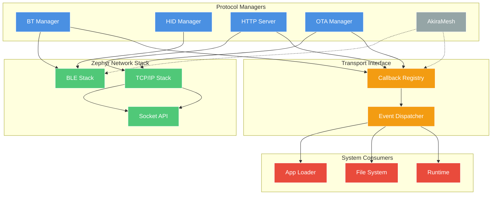
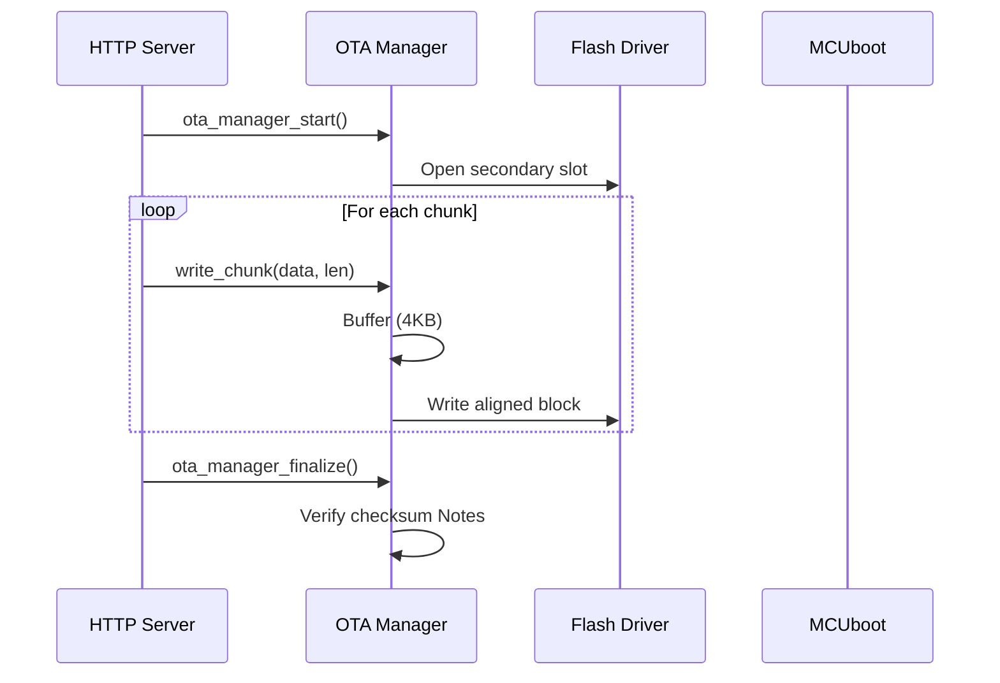

# Connectivity Layer

Modular connectivity subsystem for WiFi, Bluetooth, USB, and OTA operations.

## Architecture

**Improved Implementation:** Independent protocol managers with callback-based consumer registration.

**Key Improvements:**
- 🔄 Transport interface for pluggable consumers
- 🚀 Reduced data copies (2 instead of 4 for OTA)
- 💾 Lower stack usage (4KB instead of 9KB total)
- 🔗 Decoupled transports from consumers via callbacks



## Components

### Transport Interface (NEW)

**Purpose:** Lightweight callback registry for decoupling transports from consumers.

**Simple API:**
```c
typedef void (*transport_data_cb_t)(const uint8_t *data, size_t len, void *ctx);

// Consumer registration
int transport_register_handler(enum data_type type, 
                               transport_data_cb_t callback, 
                               void *context);

// Transport dispatch
int transport_notify(enum data_type type, 
                    const uint8_t *data, 
                    size_t len);
```

**Data Types:**
- `DATA_TYPE_WASM_APP` - WebAssembly application
- `DATA_TYPE_FIRMWARE` - OTA firmware update
- `DATA_TYPE_FILE` - Generic file
- `DATA_TYPE_CONFIG` - Configuration data

**Benefits:**
- ✅ Simple array-based registry (no hash tables)
- ✅ O(1) callback lookup
- ✅ Consumers can register/unregister dynamically
- ✅ No tight coupling between protocols and consumers

---

### Bluetooth Manager (`bluetooth/bt_manager.c`)

**Purpose:** Bluetooth Classic and BLE stack initialization and connection management.

**State Machine:**
- `BT_STATE_UNINITIALIZED` → `BT_STATE_READY` → `BT_STATE_ADVERTISING` → `BT_STATE_CONNECTED`

**Key Features:**
- Connection callbacks with reference counting
- Auto-reconnect on disconnect
- GATT service registration support
- Thread-safe state management with mutex

**Improvements:**
- ✅ Uses transport interface for data routing
- ✅ Callbacks instead of direct function calls

---

### HID Manager (`hid/hid_manager.c`)

**Purpose:** Bluetooth HID device support (keyboard, mouse, gamepad).

**Architecture:**
- Registers as GATT service via BT Manager
- Implements HID Report Protocol
- Event-based input delivery to Runtime

**Supported Devices:**
- Keyboard (standard HID keyboard report)
- Mouse (relative/absolute positioning)
- Gamepad (button + axis mapping)

**Current Limitations:**
- Synchronous report processing
- Fixed HID descriptor (no dynamic profiles)
- No consumer registration API
- Direct coupling to input handlers

---

### AkiraMesh (`mesh/` - Future)

**Purpose:** Low-latency mesh networking for inter-device communication.

**Planned Features:**
- BLE Mesh or custom protocol
- Multi-hop routing
- WASM app distribution across mesh
- Low-power sensor network support

**Status:** 🚧 Planned for v2.0

---

### App Loader (Consumer)

**Purpose:** Receives WASM applications from network transports.

**Data Sources:**
- HTTP multipart upload (`POST /upload`)
- Bluetooth file transfer
- AkiraMesh distribution (future)

**Improved Flow:**
```
Transport → Callback → App Loader → File System → Runtime (chunked)
```

**Improvements:**
- ✅ Uses transport interface callbacks
- ✅ Can report progress back to transport
- ⚠️ Still file-based intermediate storage

---

### HTTP Server (`ota/web_server.c`)

**Purpose:** HTTP/1.1 server for file uploads and OTA endpoints.

**Thread Model:**
- Dedicated thread (6KB stack)
- Blocking socket accept/recv
- Sequential request processing

**Endpoints:**
- `POST /upload` - Multipart file upload to FS
- `POST /ota/upload` - Firmware upload to OTA Manager
- `GET /status` - System status JSON

**Current Limitations:**
- Single connection at a time (no concurrent clients)
- Buffers entire multipart boundary in RAM
- No zero-copy from network to flash

---

### OTA Manager (`ota/ota_manager.c`)

**Purpose:** Firmware update handling with MCUboot integration.

**Update Flow:**


 
| Operation | Throughput | Latency | Memory | Purpose |
|-----------|------------|---------|--------|---------|
| HTTP Upload | ~1.1 MB/s | N/A | 768B + 4KB | File/WASM to FS |
| OTA Flash Write | ~200 KB/s | 50-100ms | 4KB buffer | MCUboot secondary slot |
| BLE Transfer | ~10 KB/s | <10ms | MTU (244B) | WASM app transfer |
| HID Report | N/A | <5ms | 64B | Input events |
| AkiraMesh | TBD | TBD | TBD | Future implementation |

- Message queue overhead (120s timeout issues observed)
- Thread-based instead of direct writes
- Multiple data copies (HTTP → buffer → queue → flash)

---

## Data Flow

### File Upload (HTTP → FS)

```
1. HTTP recv() → 768B buffer
2. Parse multipart boundary
3. Extract file data
4. fs_write() → LittleFS → Flash
```

**Copies:** 2 (network buffer → HTTP buffer → FS write buffer)

### Firmware Upload (HTTP → OTA)

```
1. HTTP recv() → 768B buffer
2. Send to OTA queue (k_msgq_put)
3. OTA thread wakes → dequeue
4. Write to 4KB buffer
5. Flush to flash when aligned
```

**Copies:** 4 (network → HTTP → queue → OTA buffer → flash)

---

## Performance Characteristics

| Operation | Throughput | Latency | Memory |
|-----------|------------|---------|--------|
| HTTP Upload | ~1.1 MB/s | N/A | 768B + 4KB |
| OTA Flash Write | ~200 KB/s | 50-100ms | 4KB buffer |
| BLE Transfer | ~10 KB/s | <10ms | MTU (244B) |
| HID Report | N/A | <5ms | 64B |

---

## Design Principles (Current)

1. **Modularity** - Each protocol is self-contained
2. **Thread Isolation** - OTA/HTTP run in dedicated threads
3. **Safety** - Mutex protection for shared state
4. **Simplicity** - Direct function calls, no abstraction layers


